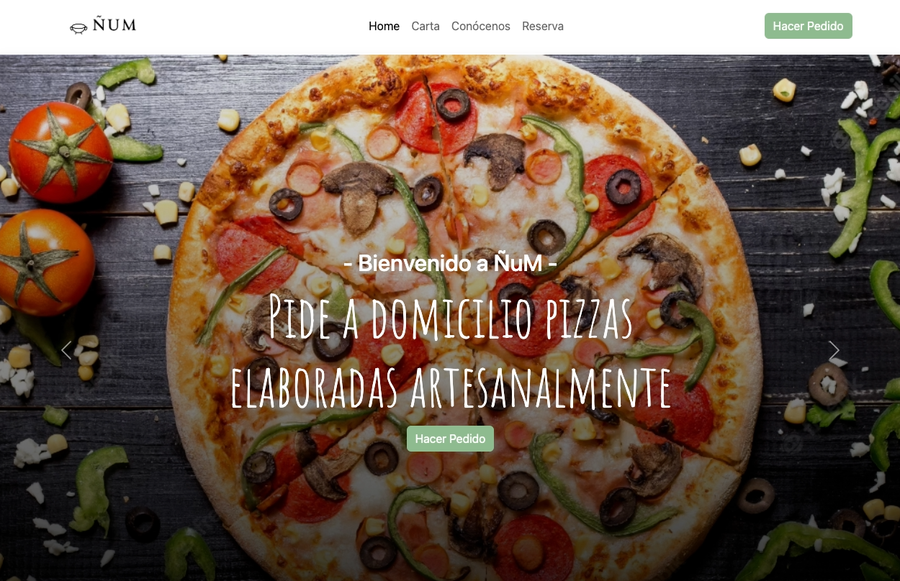
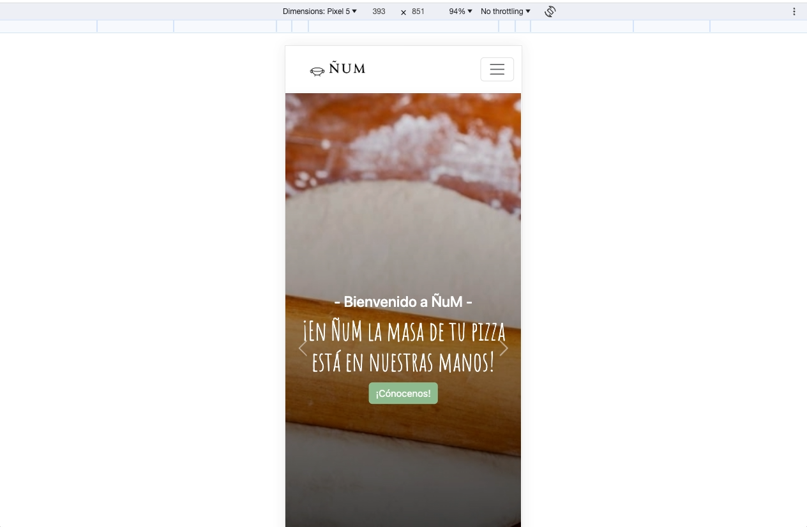
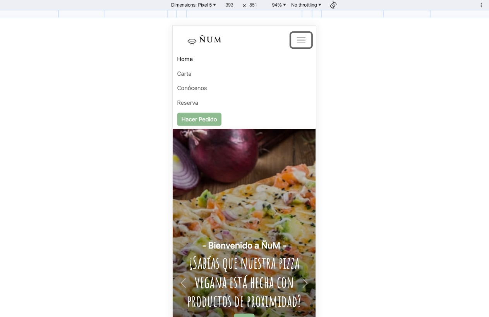
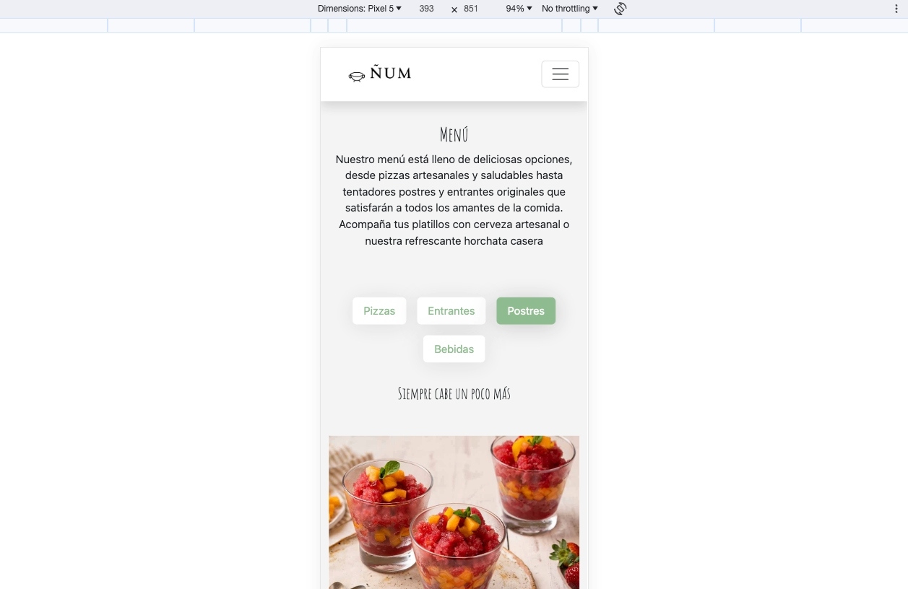
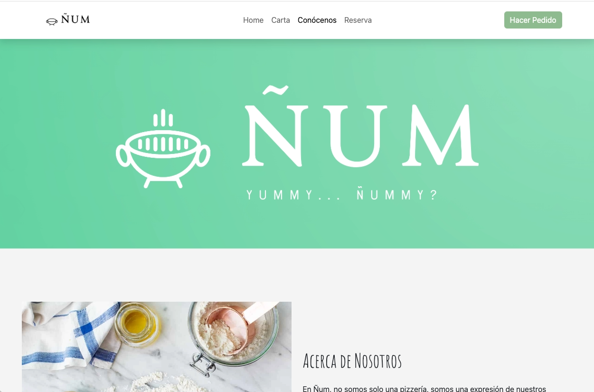
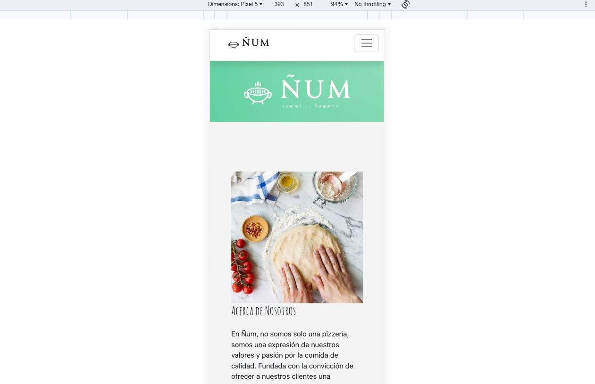
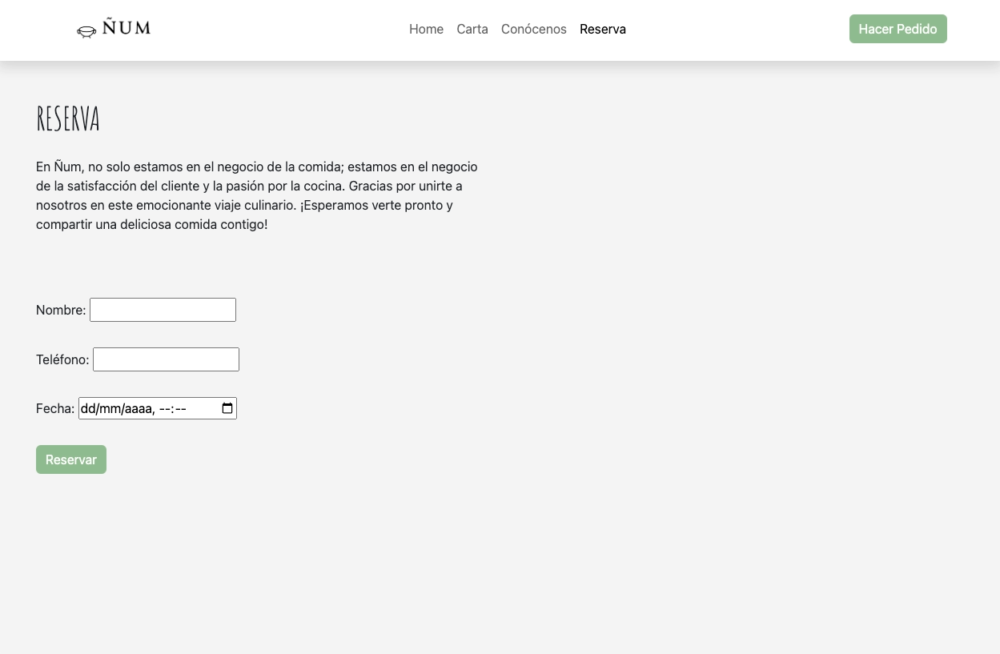
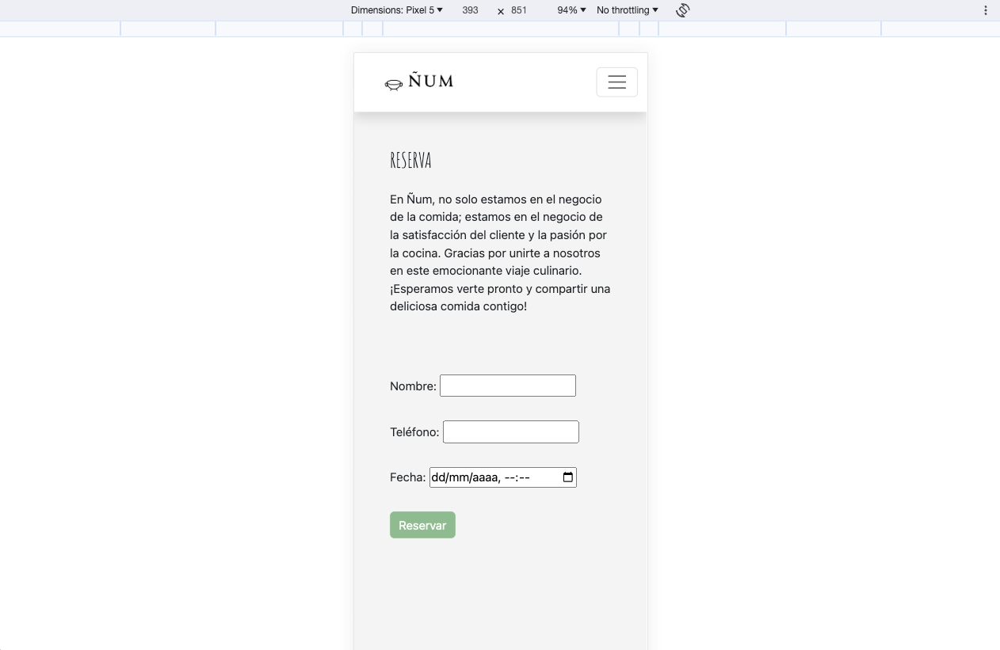

# Proyecto 1 - Carta Restaurante Digital

Hola mundo! : )

Este es mi primer proyecto como parte del Bootcamp Fullstack Developer de Geekshubs y también mi primera página web. 

He creado la imagen de marca de una supuesta pizzeria que ofrece productos artesanales y de proximidad.

### Despliegue en Github Pages

https://paco-fuentes.github.io/btc-geekshubs-15092023-proyecto-1/ 

### Descripción del Proyecto

El proyecto consiste en una página web para una pizzaería llamada "Ñum", donde se presenta una carta digital, información sobre el restaurante y una sección de inicio.

### Tecnologías utilizadas

  

### Características

**Página de Inicio.** 

Presentación de la pizzería Ñum. Se trata de la pagína de inicio con imagenes muy grandes de presentación de la pizzería dentro de un componente de carousel.

**Página de la Carta.** 

Lista de todos los platos disponibles en el menú, ordenados en una matriz con un selector de pizzas, entrantes, postres y bebidas.

**Página de About us.** 

Información sobre los principios y valores del restaurante. Composición básica de bootstrap de fila y columna, con un gran baner arriba, con una imagen del logo creado para esta maqueta, y texto explicando los valores de la marca.

**Página de Reserva.** 

Sección de reserva. Esta página en un principio era la seccion final de "Sobre nosotros" pero decidí crear otro apartado para ponerle un mapa con la etiqueta iframe que por falta de tiempo no pude incluir sin que rompiese la composición.

### Logros

- He conseguido hacer un diseño 100% responsive cumpliendo los obejetivos que me había propuesto:

    - Navbar y Footer
    - Carousel a pantalla completa.
    - Carta con selector de famlia de alimentos.
    - Sección about por columnas y con banner.
    - Maqueta de página de reserva.

- He adquirido la capacidad de afrontar un futuro diseño en bootstrap de manera más fluida, el uso, conocimiento y manipulación de clases CSS, tanto creadas, como manipuladas de elementos Bootstrap.

### Mejoras

- Al tratarse de un proyecto de caracter muy urgente con una tecnogía nueva (Bootstrap) y no tener mucho bagage escribiendo código este me ha quedado muy sucio, algo para tener en cuenta a mejorar en siguientes proyectos.

- No conseguí colocar un mapa dentro de una etiqueta iframe en la sección about por falta de tiempo.

- No conseguí investigar a tiempo la recolocación de las filas y columnas de la seccion "Sobre nosotros" en modo móvil y no me gusta que en el orden vertical de este modo se vean dos imágenes seguidas.

### Bugs Conocidos a la entrega del proyecto

1. Las flechas del selector del carousel en la pantalla de inicio se superponen al texto en modo móvil.
2. Error en el que si hay más texto en las cards de la carta del menú, estas pierden su proporción vertical.

### Licencia

Este proyecto está bajo la Licencia MIT. Consulta el archivo [LICENSE](insertar enlace al archivo LICENSE) para obtener más detalles.

### Autor

- Paco Fuentes

