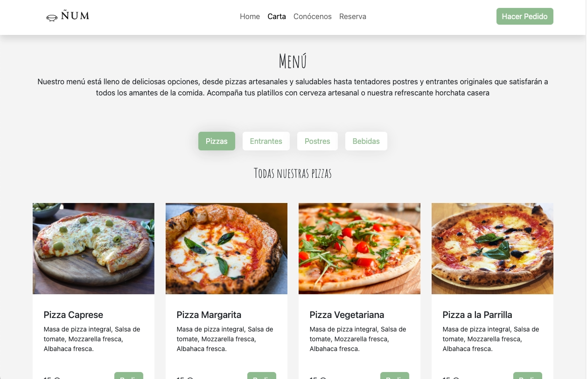

# Proyecto 1 - Carta Restaurante Digital

Hola mundo! : )

Este es mi primer proyecto como parte del Bootcamp Fullstack Developer de Geekshubs y también mi primera página web.

### Despliegue en Github Pages

https://paco-fuentes.github.io/btc-geekshubs-15092023-proyecto-1/ 

### Descripción del Proyecto

El proyecto consiste en una página web para una pizzaería llamada "Ñum", donde se presenta una carta digital, información sobre el restaurante y una sección de inicio.

### Tecnologías utilizadas

  

### Características

**Página de Inicio.** 

Presentación de la pizzería Ñum.

**Página de la Carta.** 

Lista de todos los platos disponibles en el menú.

- Sobre Nosotros: Información sobre los principios y valores del restaurante.

- Reserva: Sección de reserva.

### Bugs Conocidos

1. Las flechas del selector del carousel en la pantalla de inicio se superponen al texto en modo móvil.
2. Error en el que si hay más texto en las cards de la carta del menú, estas pierden su proporción vertical.

### Licencia

Este proyecto está bajo la Licencia MIT. Consulta el archivo [LICENSE](insertar enlace al archivo LICENSE) para obtener más detalles.

### Autor

- Paco Fuentes

